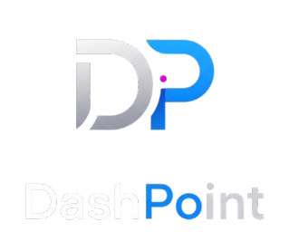
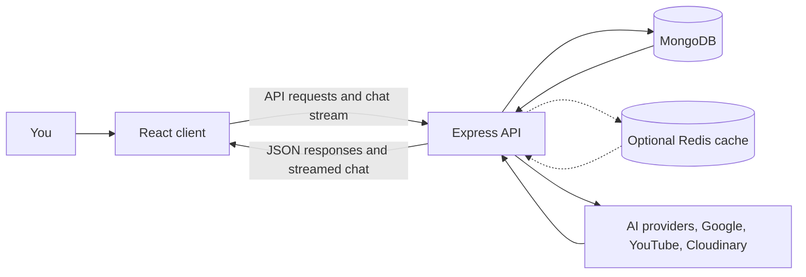

<div align="center">



# DashPoint

### Your work, ideas, and plans in one place.

An open-source workspace for conversations, collections, files, videos, and planning.

[](LICENSE)


</div>

---

## What is DashPoint?

DashPoint is a personal productivity workspace that brings the tools and information you use to move work forward into one application. Keep project materials in collections, ask questions about saved context, manage files and links, plan work, and connect your calendar.

The project is a work in progress. Some capabilities depend on optional services and credentials, such as an AI provider, Google Calendar, YouTube Data API, or Cloudinary.

## Why I started it

I wanted everything I use to think, plan, and get work done to live in one place. The idea was to keep adding useful pieces gradually and let them work together as one workspace.

I started DashPoint before announcements around products like Spark and Muse. When those announcements came, I lost motivation and stopped working on this repository for a while. Later, I realized I could open the project so anyone could help improve it. I also wanted to learn how to maintain an open-source project, welcome contributions, and manage a repository well.

That is why DashPoint is public: it gives the project room to grow and gives me a chance to learn alongside the community.

---

## Core capabilities

### AI workspace assistant

Chat with your workspace and selected collections using the configured AI provider. The assistant can use saved context, stream responses, and help with supported document and video workflows.

### Collections and knowledge

Create collections around a project or topic. Add notes, uploaded files, saved links, YouTube videos, and planner widgets to keep related information together.

### Files and documents

Upload and organize files, save web links, preview supported content, and create document summaries. Cloud file storage uses Cloudinary when configured.

### Calendar and planning

Use planner widgets in your workspace and connect Google Calendar to view and create events. Calendar integration is optional.

### YouTube and search

Search for videos, save them to collections, and use available transcript and insight features. Search across workspace content to find saved information again.

### Installable web app

The client is a progressive web app (PWA). On supported browsers, install DashPoint for an app-like experience. Production installation requires HTTPS.

---

## How it works



The client and server are maintained as separate applications with their own dependencies and configuration. For the detailed request flow, see the [client guide](client/README.md) and [server guide](server/README.md).

```text
DashPoint/
├── client/   React application, user interface, and PWA
└── server/   Express API, authentication, data models, and integrations
```

---

## Run from source

### Requirements

- Node.js 22 or newer
- MongoDB, local or hosted
- Optional credentials for the integrations you want to use

### 1. Get the source

```bash
git clone https://github.com/amansinghnishad/DashPoint.git
cd DashPoint
```

### 2. Configure and start the server

```bash
cd server
npm ci
cp .env.example .env
```

Set `MONGODB_URI`, `JWT_SECRET`, and `JWT_REFRESH_SECRET` in `server/.env`. Use private random values of at least 32 characters for both JWT secrets. Then start the API:

```bash
npm run dev
```

The API defaults to `http://localhost:5000`; its health endpoint is `http://localhost:5000/health`.

### 3. Start the client

In a second terminal:

```bash
cd client
npm ci
npm run dev
```

Open the local URL printed by Vite, usually `http://localhost:5173`. By default, the client sends API requests to `http://localhost:5000/api`.

### 4. Configure optional integrations

Add credentials for the services you want to use to `server/.env`. The full variable list and integration notes are in [`server/.env.example`](server/.env.example) and the [server setup guide](server/README.md). Google sign-in also uses `VITE_GOOGLE_CLIENT_ID` in `client/.env`.

---

## Project guides

- [Client guide](client/README.md) — setup, frontend architecture, PWA, routes, and checks
- [Server guide](server/README.md) — setup, API routes, configuration, integrations, and tests

## Contributing

Contributions, bug reports, and thoughtful feedback are welcome. You can help with interface improvements, feature work, fixes, or documentation.

Please keep pull requests focused and include a clear description of the change. For interface changes, screenshots or a short recording help reviewers. Never commit API keys, OAuth secrets, personal files, or production data.

## License

DashPoint is available under the [MIT License](LICENSE).
