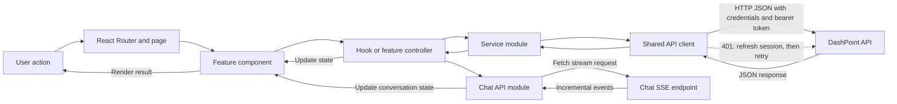

# DashPoint Client

The client is DashPoint’s React application. It includes the public landing page, account flows, workspace dashboard, feature interfaces, API client, and installable progressive web app (PWA).

## Stack

- React 19 and React Router 7
- Vite 8 for development and production builds
- Tailwind CSS 4
- Axios for API requests
- Framer Motion for interface animations
- Vitest and Testing Library for client tests
- `vite-plugin-pwa` and Workbox for the service worker and offline asset caching

## Requirements

- Node.js 22 or newer
- The DashPoint API running locally or a reachable API deployment

## Local setup

```bash
npm ci
```

Create a `.env` file in `client/` when you need to change the API URL or enable Google sign-in:

```dotenv
VITE_API_URL=http://localhost:5000/api
VITE_GOOGLE_CLIENT_ID=your_google_client_id
```

`VITE_API_URL` defaults to `http://localhost:5000/api`. `VITE_GOOGLE_CLIENT_ID` controls whether the Google sign-in option is shown; Google authentication also requires matching server-side OAuth configuration.

Start the development server:

```bash
npm run dev
```

Vite prints the local URL, usually `http://localhost:5173`.

## Useful scripts

| Command | Purpose |
| --- | --- |
| `npm run dev` | Start the Vite development server. |
| `npm run build` | Create the production build in `dist/`. |
| `npm run preview` | Serve the production build locally. |
| `npm run lint` | Run ESLint. |
| `npm test` | Run the Vitest test suite once. |
| `npm run test:watch` | Run Vitest in watch mode. |
| `npm run validate:pwa` | Check PWA build artifacts and configuration. |
| `npm run check:pwa` | Build the client, then validate the PWA artifacts. |
| `npm run format:check` | Check formatting with Prettier. |

## Application structure

```text
src/
  app/          Application providers, routes, and global styles
  context/      Authentication, dashboard, toast, and PWA state
  features/     Feature pages and feature-specific components
    auth/       Sign-in, registration, and account layouts
    dashboard/  Workspace shell and dashboard features
    landing/    Public landing page and product showcases
  hooks/        Shared React hooks
  services/     API request modules
  shared/       Shared API, auth, config, utilities, and UI
  test/         Test setup
```

Feature-owned UI belongs under `src/features/<feature>`. Reusable elements and shared behavior belong under `src/shared`, `src/hooks`, or the appropriate app/context folder. The `@` alias resolves to `src/`.

## How client data moves



Pages and components handle presentation and user input. Feature hooks coordinate loading, mutations, and local state; service modules translate those actions into API requests. The shared Axios client adds the current bearer token and sends cookies, then handles eligible expired-session responses by refreshing the session and retrying the request. The chat stream uses `fetch` so the interface can consume server-sent events as they arrive. Responses flow back through the service or stream handler and update the page state.

## Routes and API connection

The client uses React Router with browser-history URLs. API modules are under `src/services/modules`; shared request configuration and authentication behavior are under `src/shared/api` and `src/shared/auth`. Local development uses `VITE_API_URL` (including `/api`). Production builds use `/api` on the client origin; `vercel.json` proxies that path to the production API so authentication cookies remain first-party.

For local development, the server allows the Vite origin by default. For another client origin or a deployed client, configure the corresponding server `CLIENT_URL` value as described in [`../server/README.md`](../server/README.md).

## Progressive web app

PWA manifest and service-worker generation are configured in `vite.config.js`. The service worker uses prompt-based updates, precaches production assets, and uses a bounded cache for same-origin images. The development server also enables the PWA plugin for local inspection.

To inspect a production-style build locally:

```bash
npm run build
npm run preview
```

PWA installation requires a secure context: HTTPS in production, or localhost during development. Browser installation prompts are controlled by the browser and may not appear until its installability requirements are met.

## Production routing

Because the app uses browser-history routes, the host must return `index.html` for client-side URLs such as `/login` and `/dashboard`. The included `vercel.json` provides a Vercel rewrite, and `public/_redirects` provides a fallback rule for hosts that support that format. Keep the SPA rewrite when deploying the contents of `dist/` so reloading a nested route does not return a host-level 404.

The Vercel configuration also avoids stale caching for the app shell, manifest, and service worker. Keep the API rewrite pointed at the deployed server and allow the deployed client origin in the server’s `CLIENT_URL` setting.

## Client tests

```bash
npm test
```

Run `npm run lint` and `npm run build` before submitting changes when practical. For a PWA-related change, use `npm run check:pwa` as well.
