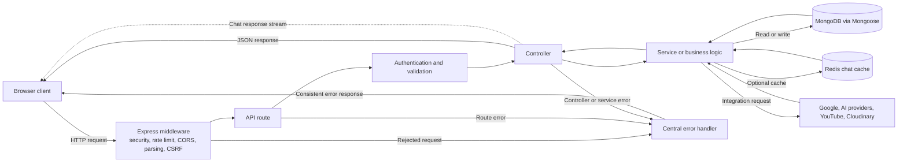

# DashPoint Server

The server is DashPoint’s Express API. It handles account authentication, workspace data, document uploads, planning, calendar connections, search, and assistant requests. MongoDB stores application data; Redis is an optional cache for chat responses.

## Stack

- Node.js 22 or newer
- Express 4 and Mongoose 8
- MongoDB for persistent data
- JWT access and refresh tokens for authentication
- Multer and Cloudinary for file uploads
- Google APIs and OAuth for calendar integration
- OpenAI and Gemini provider clients for assistant and document features
- Redis for optional chat response caching
- Jest and Supertest for API tests

## Requirements

- Node.js 22 or newer
- A reachable MongoDB database
- Optional credentials for the integrations you plan to use
- Redis is optional; without it, chat response caching is disabled

## Local setup

From the repository root:

```bash
cd server
npm ci
cp .env.example .env
```

At minimum, set `MONGODB_URI`, `JWT_SECRET`, and `JWT_REFRESH_SECRET` in `server/.env`. Use private random secrets of at least 32 characters for both JWT secrets. Keep `.env` out of version control.

Start the development server:

```bash
npm run dev
```

The API listens on port `5000` by default. Open `http://localhost:5000/health` to check whether the API and MongoDB are ready. The root endpoint (`http://localhost:5000/`) returns basic API information.

## Configuration

The complete variable list and local defaults are in [`.env.example`](.env.example). Common settings:

| Purpose | Variables |
| --- | --- |
| Database and server | `MONGODB_URI`, `PORT`, `NODE_ENV` |
| Authentication | `JWT_SECRET`, `JWT_REFRESH_SECRET`, `JWT_ACCESS_EXPIRES_IN`, `JWT_REFRESH_EXPIRES_IN` |
| Request limits | `RATE_LIMIT_WINDOW_MS`, `RATE_LIMIT_MAX_REQUESTS` |
| Client CORS and OAuth redirect | `CLIENT_URL`, `GOOGLE_OAUTH_SUCCESS_REDIRECT` |
| Google Calendar | `GOOGLE_CLIENT_ID`, `GOOGLE_CLIENT_SECRET`, `GOOGLE_OAUTH_REDIRECT_URI`, `GOOGLE_OAUTH_SCOPES` |
| AI providers | `OPENAI_API_KEY`, `GEMINI_API_KEY`, model settings, and `EMBEDDING_PROVIDER` |
| YouTube | `YOUTUBE_API_KEY` |
| Uploads | `CLOUDINARY_CLOUD_NAME`, `CLOUDINARY_API_KEY`, `CLOUDINARY_API_SECRET`, and upload limits |
| Optional chat cache | `REDIS_ENABLED`, `REDIS_URL`, and cache prefix/TTL settings |

`CLIENT_URL` is the exact client origin, or a comma-separated list of allowed origins. For local use, `http://localhost:5173` is the client origin. In production, set it to the deployed client origin. Google OAuth client IDs, callback URLs, and allowed origins must agree with the Google Cloud OAuth configuration and the client’s `VITE_GOOGLE_CLIENT_ID`.

Redis caching can be turned off with `REDIS_ENABLED=false`. If enabled without a usable `REDIS_URL`, the API logs that the chat cache is disabled and continues without it.

## API routes

Routes are mounted in [`src/server.js`](src/server.js):

| Base path | Responsibility |
| --- | --- |
| `/api/auth` | Registration, login, profile, and Google authentication |
| `/api/collections` | Collections and collection items |
| `/api/files` | Uploads, saved links, downloads, and previews |
| `/api/youtube` | Saved and searched YouTube content |
| `/api/planner-widgets` | Planner widget data |
| `/api/calendar` | Google Calendar connection and events |
| `/api/chat` | Assistant conversations and chat history |
| `/api/search` | Workspace search |
| `/api/focus` | Focus sessions |
| `/api/insights` | Extracted content insights |
| `/health` | API and MongoDB readiness |

The root route `/` returns the API name, version, and endpoint list. Unknown paths return a JSON 404 response.

## Server structure

```text
src/
  config/       MongoDB, Redis, and application configuration
  controllers/  Request handlers
  middleware/   Authentication, CSRF, validation, uploads, and error handling
  models/       Mongoose models
  routes/       Express route definitions
  services/     Business logic and AI provider integrations
  utils/        Shared server utilities
scripts/        One-off database maintenance scripts
```

Requests pass through security, CORS, rate-limit, parsing, and CSRF middleware before reaching the route layer. Routes call controllers, which use services and Mongoose models where appropriate. The API uses Helmet, credentialed CORS, request rate limits, and a centralized error handler.

## How server data moves



For a typical request, middleware applies the shared request checks before a route selects its controller. Authentication and route-level validation protect the operation; the controller coordinates the request and delegates domain work to services. Services read or write MongoDB and call external providers when needed. Redis is used only for configured chat-response caching. The controller returns JSON for regular endpoints; chat can stream events as they are produced. Errors reach the final error handler and return an API error response to the client.

## Upload limits

The server enforces the following maximums regardless of larger configured values:

- 10 MiB per file
- 5 files per request
- 25 MiB total per request

Cloudinary credentials are required for configured cloud uploads. The local `uploads/` directory is ignored by Git and should not be used as a public production storage strategy without reviewing the deployment setup.

## Scripts and tests

| Command | Purpose |
| --- | --- |
| `npm run dev` | Start the development server with Node watch mode. |
| `npm start` | Start the production server. |
| `npm run prod` | Explicitly start in production mode. |
| `npm test` | Run the Jest suite serially. |
| `npm run migrate:google-id-index` | Replace the legacy Google ID index with a partial unique index. |

Run tests with:

```bash
npm test
```

The Google ID index migration changes database indexes. Back up the configured database first, then run it once when deploying the related account-registration fix:

```bash
npm run migrate:google-id-index
```

## Deployment notes

- Set `NODE_ENV=production`, `PORT`, `MONGODB_URI`, and strong JWT secrets in the deployment environment.
- Set `CLIENT_URL` to the deployed client origin so browser requests pass CORS and CSRF origin checks.
- Configure provider credentials only for integrations that should be available.
- Keep secrets in the hosting provider’s secret manager; never commit real values to `.env.example` or source files.
- Ensure the deployment platform supports graceful shutdown and has network access to MongoDB and any enabled external services.
